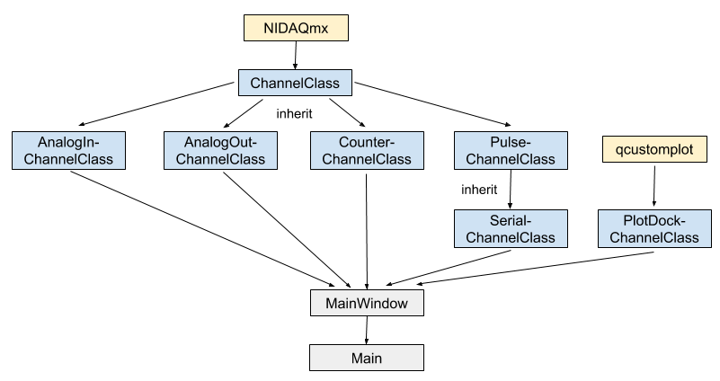
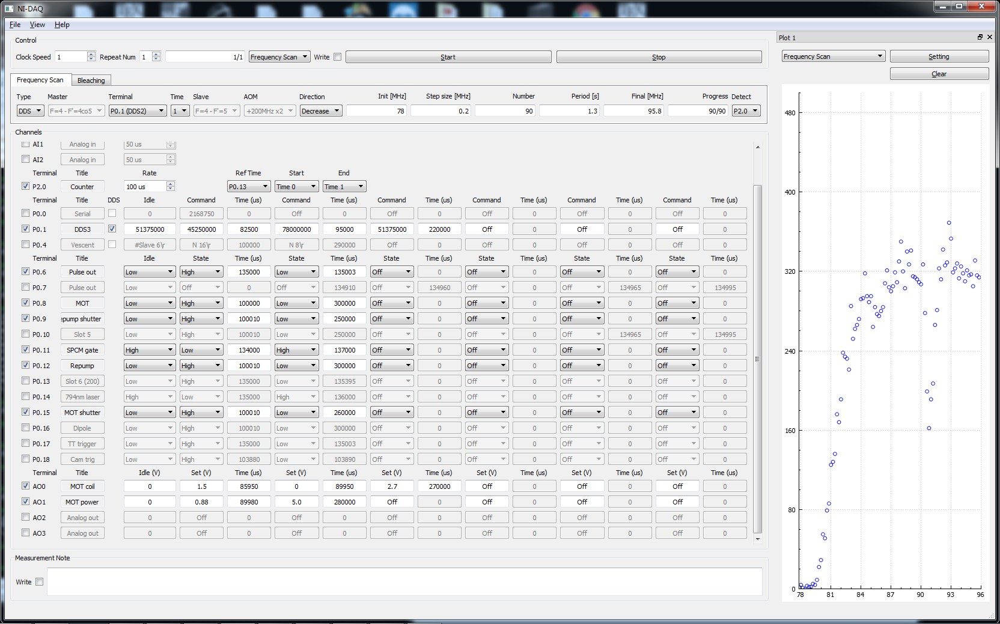

NPQO DAQ
==========

This repository contains codes of a GUI program on the Qt application framework to control various equipments and collect data via National Instrument M-Series Data Acquisition(DAQ) board.

Overview
--------

This program has three different operation modes under three tabs.

1. Single: run the sequential commands set once
2. Frequncy Scan:  run the sequential commands set by sweeping an offset locking frequency, collect data from a single photon counting module (SPCM), and plot the data in real-time
3. Bleach: run the sequential commands set with the specified control beam durations for Raman process. Data are collected by an external TimeTagger software

Dependencies
------------

- All codes are written in C/C++

- All codes are wrtten and tested with the Qt version 5.8

- In order to compile this project, the header file "NIDAQmx.h" and library "NIDAQmx.lib" are required

- "qcustomplot.cpp" is used to plot data

Description of files
--------------------

Non-Python files:

filename                     |  description
-----------------------------|------------------------------------------------------------------------------------
README.md                    |  Text file (markdown format) description of the project.

Header files:

filename                     |  description
-----------------------------|------------------------------------------------------------------------------------
channelClass.h               |  Declare ChannelClass 
analogInChannelClass.h       |  Declare AnalogInChannelClass which inherits ChannelClass
analogOutChannelClass.h      |  Declare AnalogOutChannelClass which inherits ChannelClass
counterChannelClass.h        |  Declare CountChannelClass which inherits ChannelClass
pulseChannelClass.h          |  Declare PulseChannelClass which inherits ChannelClass
serialChannelClass.h         |  Declare SerialChannelClass which inherits PulseChannelClass
plotDockClass.h              |  Declare PlotDockClass which inherits QWidget class
mainwindow.h                 |  Declare MainWindow class which inherits QMainWindow class
qcustomplot.h                |  

Source files:

filename                     |  description
-----------------------------|------------------------------------------------------------------------------------
channelClass.cpp             |  Define ChannelClass which handle functions shared by all type of channels
analogInChannelClass.cpp     |  Define AnalogInChannelClass which handles functions related with analog input channels
analogOutChannelClass.cpp    |  Define AnalogOutChannelClass which handles functions related with analog output channels
counterChannelClass.cpp      |  Define CountChannelClass which handles functions related with pulse counters
pulseChannelClass.cpp        |  Define PulsehannelClass which handles functions related with digital input/output channels
serialChannelClass.cpp       |  Define SerialClass which handles functions to generate serial commands from pulse channels
plotDockClass.cpp            |  Define PlotDockClass which handles functions to plot collected data
mainwindow.cpp               |  Define MainWindow class to generate a user interface and handles all operations
main.cpp                     |  Define main function to create MainWindow object
qcustomplot.cpp              |  

How it all fits together
------------------------

Screenshot
------------------------

